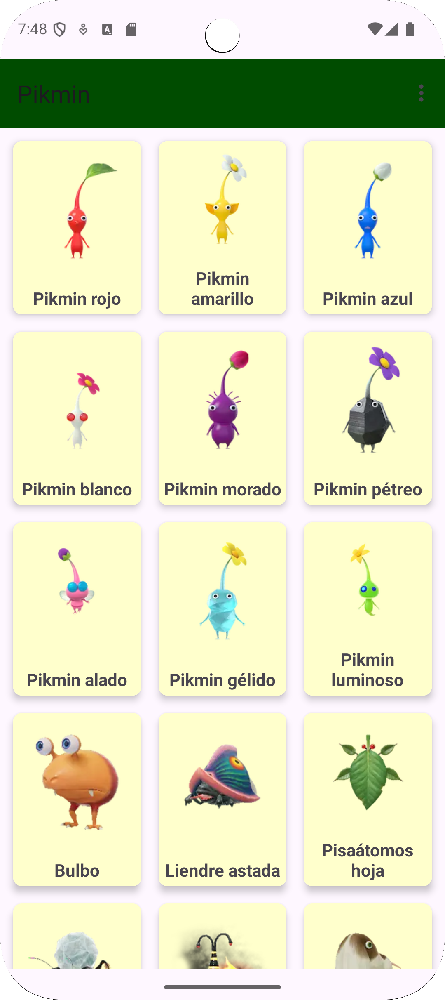
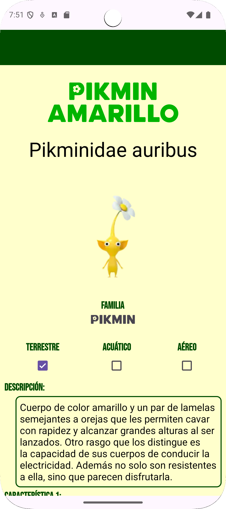
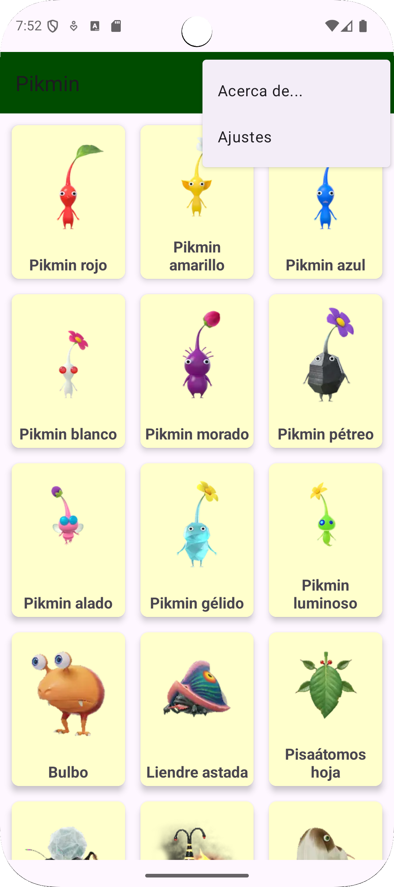

## 📱 Tarea 2 - Navegación con NavGraph
Este proyecto es parte de la asignatura de Desarrollo de Aplicaciones Multiplataforma. Se trata de una aplicación Android que implementa navegación entre pantallas utilizando NavGraph.

## 🧭 Objetivo
El objetivo principal es aprender a estructurar una aplicación Android moderna con navegación declarativa, utilizando fragmentos y un gráfico de navegación (nav_graph.xml) para gestionar las transiciones entre pantallas.

## 🛠️ Tecnologías utilizadas
- **Lenguaje:** Kotlin  
- **Entorno:** Android Studio  
- **Componentes:**  
  - `RecyclerView`  
  - `View Binding`  
  - `Intent` y `Bundle`  
  - `Toolbar` con menú XML  
  - `ConstraintLayout`  

## 📸 Capturas de pantalla
| Lista de Pikmin | Detalle del Pikmin | Menú de opciones |
|------------------|--------------------|------------------|
|  |  |  |

## 📁 Estructura del proyecto
La aplicación está organizada en paquetes que agrupan las clases según su funcionalidad, facilitando la mantenibilidad y escalabilidad del código:

# 🧩 activities
Contiene las actividades principales de la app:

- MainActivity.kt: Punto de entrada de la aplicación, aloja el NavHostFragment para la navegación.

- SplashActivity.kt: Muestra una pantalla de bienvenida o carga inicial antes de redirigir al contenido principal.

# 📦 adapter
Encargado de la gestión de listas y vistas en RecyclerView:

- PikminAdapter.kt: Adaptador que gestiona la visualización de los objetos Pikmin en una lista.

- PikminViewHolder.kt: ViewHolder que encapsula la lógica de cada ítem de la lista.

# 📚 datos
Define los modelos de datos y su creación:

- CreadorPikmins.kt: Clase encargada de generar instancias de Pikmin con datos simulados.

- Pikmin.kt: Modelo de datos que representa un Pikmin con sus atributos.

# 🧱 fragments
Fragmentos que representan las distintas pantallas de la app:

- AjustesFragment.kt: Pantalla de configuración donde el usuario puede modificar preferencias.

- DetallePikminFragment.kt: Muestra información detallada de un Pikmin seleccionado.

- ListadoPikminsFragment.kt: Lista todos los Pikmins disponibles en la aplicación.

## 🚀 Cómo ejecutar
Clona el repositorio:

bash

git clone https://github.com/pacoguti71/Tarea2_GutierrezRuiz_Francisco_VersionNavGraph.git

Abre el proyecto en Android Studio.

Sincroniza el proyecto con Gradle.

Ejecuta la app en un emulador o dispositivo físico.

## 📱 Características principales
- **Lista de Pikmin:** muestra un `RecyclerView` con nombre, tipo e imagen de cada Pikmin.  
- **Pantalla de detalles:** al pulsar un Pikmin, se abre una `fragment` con su descripción e imagen ampliada.  
- **Toolbar con menú:**  
  - **Acerca de:** muestra información del autor o de la app.  
  - **Ajustes:** permite modificar configuraciones básicas del usuario.  
- **Diseño adaptativo:** interfaz optimizada para distintos tamaños de pantalla.

## 🧑‍💻 Autor
Francisco Gutiérrez Ruiz
📚 Estudiante de Informática | 🚕 Taxista | 💻 Creador de Código para Todos
